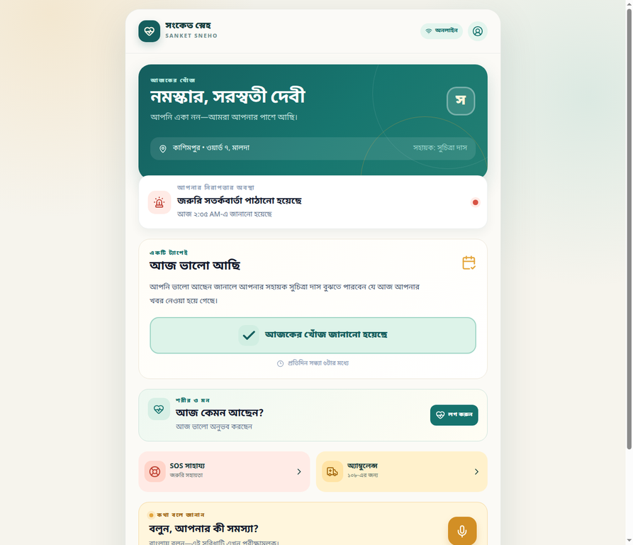
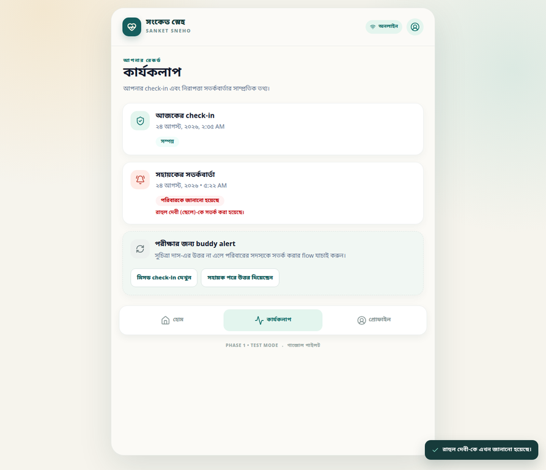
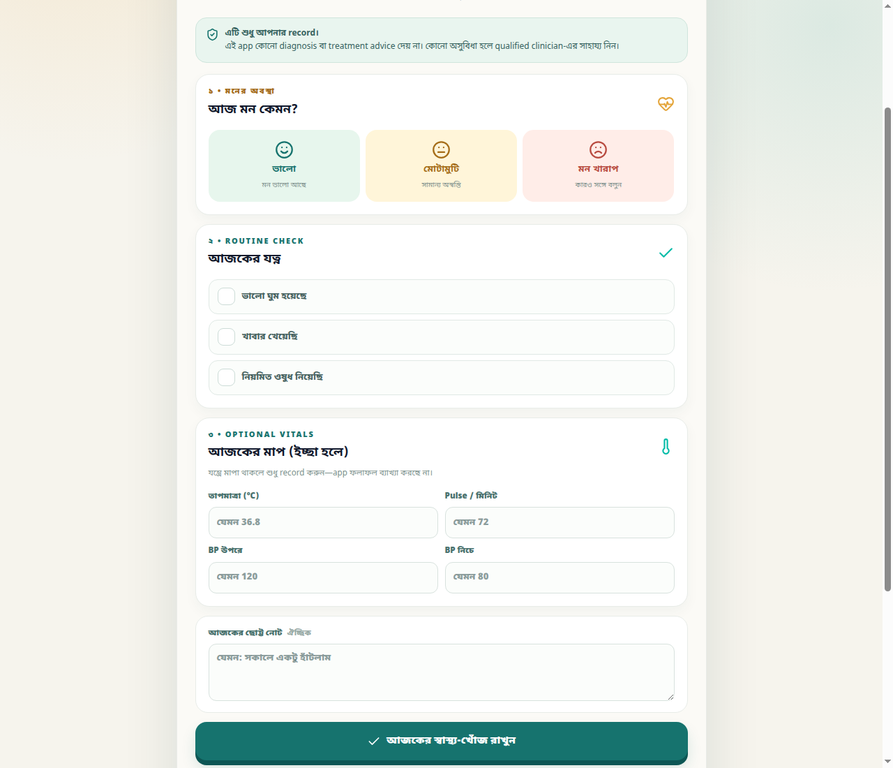
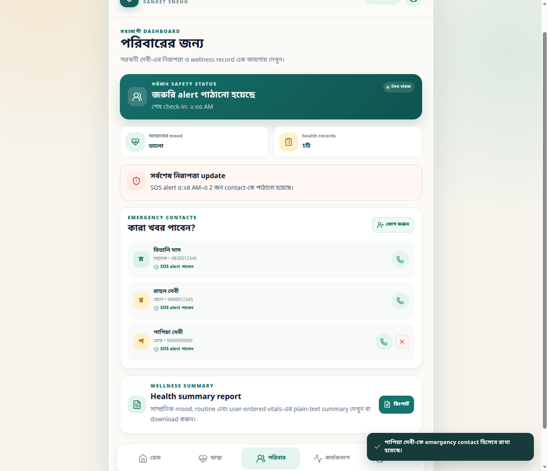
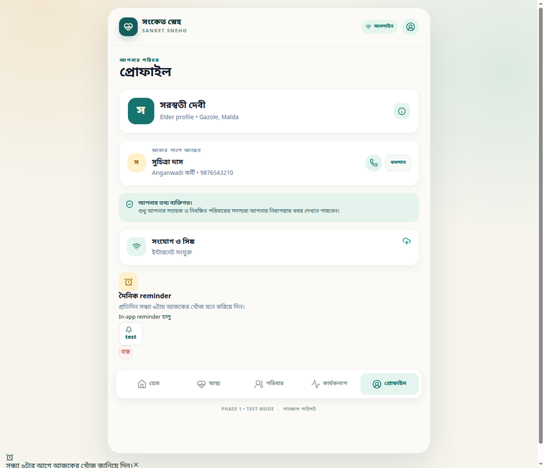

# গ্রামে একা থাকা প্রবীণদের জন্য প্রযুক্তি: Sanket Sneho কেন শুধু আরেকটি অ্যাপ নয়

প্রযুক্তি তখনই অর্থবহ হয়ে ওঠে, যখন তা মানুষের বাস্তব জীবনের ভয়, একাকীত্ব এবং অনিশ্চয়তার পাশে দাঁড়ায়। বিশেষ করে এমন প্রবীণ মানুষদের জন্য, যাঁরা একা থাকেন, দূরে থাকা পরিবারের উপর নির্ভর করেন, অথবা প্রতিদিনের যোগাযোগে ভাষা ও connectivity—দুই সমস্যারই মুখোমুখি হন।

এই ভাবনা থেকেই তৈরি হচ্ছে **Sanket Sneho (সংকেত স্নেহ)**—একটি Bengali-first elder safety ও wellness companion, যার লক্ষ্য খুব সহজ: একটি বড় button-এ আজকের খবর জানানো, প্রয়োজন হলে trusted মানুষদের alert করা, আর প্রতিদিনের শরীর ও মনের ছোট ছোট পরিবর্তনগুলি নিজের ভাষায় record করে রাখা।

*চিত্র ১: Bengali-first home screen—বড় touch target, কম navigation এবং এক নজরে safety status।*

## সমস্যাটি শুধু emergency নয়

একজন প্রবীণ মানুষের নিরাপত্তা কেবল emergency button দিয়ে মাপা যায় না। অনেক সময় ছোট একটি missed check-in-ই পরিবারের জন্য প্রথম সংকেত হতে পারে। আবার mood, ঘুম, খাবার বা নিয়মিত ওষুধ নেওয়ার মতো routine information ধারাবাহিকভাবে জানা থাকলে পরিবার এবং সহায়করা আগে থেকেই খোঁজ নিতে পারেন।

কিন্তু বাস্তবে এই তথ্যগুলি ছড়িয়ে থাকে—কখনও ফোনে, কখনও প্রতিবেশীর কথায়, কখনও কারও মনে থাকা অনুমানে। Internet দুর্বল হলে সমস্যা আরও বাড়ে। তাই Sanket Sneho-র design প্রশ্নটি ছিল: **একজন প্রবীণ মানুষ কি খুব কম শেখার মধ্যেই নিজের খবর জানাতে পারবেন?**

## একটি ছোট “আজ ভালো আছি” থেকে শুরু

Sanket Sneho-তে daily safety check-in একটি primary action। Elder শুধু “আজ ভালো আছি” button-এ চাপ দেন। এতে তাঁর assigned buddy বুঝতে পারেন যে আজকের খবর নেওয়া হয়ে গেছে। Check-in না হলে test workflow-এ buddy alert, acknowledgement এবং প্রয়োজন হলে family escalation দেখা যায়।

এখানে product philosophy খুব পরিষ্কার: alert তৈরি করা সহজ হবে, কিন্তু ভুল করে alert পাঠানো হবে না। তাই SOS-এর আগে confirmation screen থাকে এবং কোন buddy ও family member খবর পাবেন, তা আগে দেখানো হয়।

## Buddy, পরিবার এবং SOS—তিনটি আলাদা স্তর

একজন local ASHA সহায়ক, Anganwadi কর্মী বা trusted volunteer নিয়মিত খোঁজ নিতে পারেন। Profile থেকেই assigned buddy update করা যায়। Missed check-in হলে তাঁর জন্য alert state তৈরি হয়; response না এলে family contact-কে জানানো যায়।

আর সত্যিকারের জরুরি অবস্থার জন্য রয়েছে আলাদা SOS flow। এতে assigned buddy এবং registered family contacts-এর preview দেখা যায়। Confirm করার পরে immediate alert state তৈরি হয়। GPS permission থাকলে location capture করার চেষ্টা করা হয়; permission না থাকলেও alert flow বন্ধ হয় না—history-তে GPS fallback status record থাকে।

*চিত্র ২: SOS flow-এ clear confirmation এবং recipient visibility—কার কাছে alert যাবে, তা আগে থেকেই বোঝা যায়।*

> **গুরুত্বপূর্ণ:** বর্তমান release একটি pilot/test-mode frontend। এটি real SMS, FCM push, emergency dispatch বা ambulance booking করে না। বাস্তব emergency-তে স্থানীয় emergency service, পরিবার বা ১০৮ ambulance service-এর সঙ্গে সরাসরি যোগাযোগ করতে হবে।

## Health logging—diagnosis নয়, continuity of care-এর context

Sanket Sneho-র health section-এ elder প্রতিদিন mood বেছে নিতে পারেন—ভালো, মোটামুটি, অথবা মন খারাপ। এরপর ঘুম, খাবার এবং নিয়মিত ওষুধ নেওয়ার মতো routine item mark করা যায়। যন্ত্রে মাপা থাকলে temperature, pulse এবং BP optional হিসেবে record করা যায়; সঙ্গে ছোট একটি note-ও লেখা যায়।

*চিত্র ৩: Mood, routine এবং optional vitals—সবকিছু বড়, সহজে বোঝা যায় এমন Bengali-first form-এ।*

এখানে একটি safety boundary ইচ্ছাকৃতভাবে রাখা হয়েছে: **এই app কোনো diagnosis বা treatment advice দেয় না।** এটি user-entered wellness record-এর একটি সরল নথি। Family member চাইলে dashboard থেকে plain-text health summary preview করতে এবং `.txt` report download করতে পারেন। গুরুত্বপূর্ণ স্বাস্থ্য সিদ্ধান্তের জন্য qualified clinician-এর পরামর্শই প্রয়োজন।

## পরিবারকে শুধু alert নয়, context-ও দেওয়া

Family dashboard-এ elder-এর safety status, শেষ check-in, latest mood, health record count, emergency contacts এবং recent emergency update এক জায়গায় দেখা যায়। এতে পরিবার কেবল “সব ঠিক আছে কি না” জানতে পারে না; তাঁরা বুঝতে পারেন, গত কয়েক দিনের routine record কেমন ছিল।

*চিত্র ৪: Family dashboard—safety status, emergency contacts, wellness glance এবং health report entry point এক জায়গায়।*

Emergency contact যোগ করার সময় নাম, সম্পর্ক, ফোন নম্বর এবং priority রাখা যায়। Elder-এর consent, family role এবং access control-এর গুরুত্ব আমরা design-এর শুরু থেকেই স্বীকার করেছি। বর্তমান prototype-এ data browser local storage-এ থাকে; production release-এর আগে authenticated backend, encrypted storage, role-based access এবং audit trail আবশ্যক।

## Connectivity দুর্বল হলেও care যেন থেমে না যায়

এই project-এর আরেকটি গুরুত্বপূর্ণ দিক হলো offline-first ভাবনা। Internet না থাকলে check-in, health log, emergency alert বা contact update ফোনেই locally রাখা হয় এবং sync queue-তে অপেক্ষা করে। Network ফিরে এলে sync status update হওয়ার কথা app-এ দেখা যায়।

প্রতিদিন সন্ধ্যা ৬টার reminder-এর জন্য browser notification permission চাওয়া হয়। Permission না পাওয়া গেলে in-app reminder fallback থাকে। অর্থাৎ notification বন্ধ থাকলেও user যেন পুরো feature থেকে বাদ না পড়েন।

*চিত্র ৫: Browser permission না থাকলেও in-app reminder fallback—সন্ধ্যার check-in ভুলে না যাওয়ার জন্য।*

## Design principle: কম feature নয়, কম cognitive load

এই application-এর visual design-এ warm saffron, deep teal এবং cream palette ব্যবহার করা হয়েছে। কিন্তু রঙের চেয়েও গুরুত্বপূর্ণ ছিল interaction design: বড় typography, স্পষ্ট Bengali label, কম screen depth, high-contrast safety action এবং emergency flow-এ আলাদা visual language।

আমরা বিশ্বাস করি, elder-facing product-এ “modern” দেখানোর চেয়ে “ভরসা জাগানো” বেশি গুরুত্বপূর্ণ। তাই app-এর প্রতিটি screen-এ প্রশ্নটি ছিল: একজন প্রথমবারের user কি এটি দেখে বুঝবেন, এখন তাঁকে কী করতে হবে?

## বর্তমান status এবং পরবর্তী পথ

Sanket Sneho-র বর্তমান release একটি **MVP/pilot demonstration build**। এতে elder onboarding, daily check-in, buddy escalation, SOS state, routine health logging, emergency contacts, family dashboard, local reminder, offline sync indicator এবং health summary report workflow তৈরি হয়েছে।

পরবর্তী production milestones হবে authenticated multi-user backend, encrypted health data, real SMS/FCM notification, background sync, native local notifications, consent management, audit logs, verified GPS sharing এবং emergency-service integration। এই পথটি শুধু engineering-এর নয়; field worker, elder, family, public-health specialist, privacy expert এবং community organisation—সব পক্ষের feedback প্রয়োজন।

## একটি invitation

যদি আপনি elder care, rural health, digital public infrastructure, accessibility, community operations বা responsible technology নিয়ে কাজ করেন, তাহলে Sanket Sneho নিয়ে আপনার মতামত জানতে চাই। কোন feature একজন প্রবীণের জন্য সত্যিই helpful হবে? কোন notification trusted মনে হবে? কোথায় privacy risk তৈরি হতে পারে? আর কীভাবে এই ধরনের technology local language ও local support network-এর সঙ্গে আরও ভালোভাবে যুক্ত হতে পারে?

Sanket Sneho repository: [github.com/susankarkarmakar-pixel/sanket-sneho](https://github.com/susankarkarmakar-pixel/sanket-sneho)

এই project-এর মূল বিশ্বাস এক লাইনে বলা যায়: **একটি ছোট check-in কখনও কখনও একটি বড় নিরাপত্তার সেতু হয়ে উঠতে পারে।**

#SanketSneho #সংকেতস্নেহ #ElderCare #DigitalHealth #RuralInnovation #BengaliFirst #ResponsibleTechnology #Accessibility #PublicHealth #CommunityCare
