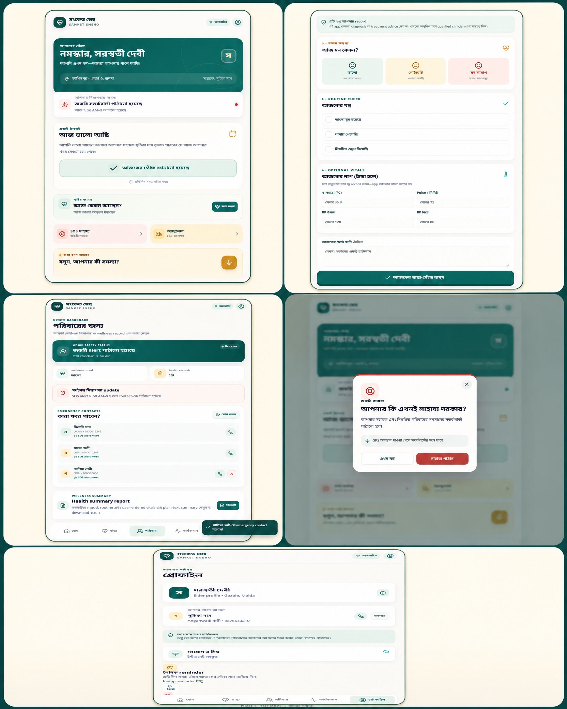

# Technology for Elders Living Alone in Rural Communities: Why Sanket Sneho Is More Than Just Another App

Technology becomes meaningful when it stands beside people in their real moments of fear, loneliness, and uncertainty. This is especially true for older adults who live alone, depend on family members living far away, or face both language and connectivity barriers in everyday communication.

That is the idea behind **Sanket Sneho (সংকেত স্নেহ)**—a Bengali-first elder safety and wellness companion with one simple goal: make it easy for an older adult to share a daily update with one large button, alert trusted people when help may be needed, and record small changes in mood and wellbeing in their own language.

*Visual: A single visual collage showing the Sanket Sneho home, health logging, family dashboard, SOS confirmation, and reminder screens.*

## The problem is not only an emergency

An older adult’s safety cannot be measured only by an emergency button. Sometimes a missed daily check-in is the first signal that a family member needs to call. Consistent information about mood, sleep, food, or routine medicine can also help a family or community support worker notice when it is time to reach out.

In reality, this information is scattered—sometimes in phone calls, sometimes in a neighbour’s memory, and sometimes nowhere at all. The problem becomes more difficult when internet connectivity is unreliable. So the key design question for Sanket Sneho was: **Can an older adult share their status with almost no learning curve?**

## It starts with one small “I am well today” action

The daily safety check-in is the primary action in Sanket Sneho. An elder simply taps the “I am well today” button. Their assigned buddy can then understand that the daily check-in has been completed. If a check-in is missed, the test workflow shows a buddy alert, acknowledgement, and—when necessary—family escalation.

The product philosophy is deliberately simple: creating an alert should be easy, but sending one accidentally should be difficult. That is why the SOS flow includes a confirmation screen and shows which buddy and family members will receive the alert before it is confirmed.

## Three layers of support: buddy, family, and SOS

A local ASHA worker, Anganwadi worker, or trusted volunteer can serve as a regular buddy. The assigned buddy can be updated from the profile screen. If a check-in is missed, an alert state is created for the buddy; if there is no response, the family contact can be notified.

For a genuine emergency, there is a separate SOS flow. It previews the assigned buddy and registered family contacts before confirmation. Once confirmed, an immediate alert state is created. If location permission is available, the app attempts to capture location. If permission is not granted, the alert flow does not stop—the activity history records a safe GPS fallback status instead.

> **Important:** The current release is a pilot/test-mode frontend. It does not send real SMS, FCM push notifications, emergency dispatches, or ambulance bookings. In a real emergency, contact local emergency services, family, or the 108 ambulance service directly.

## Health logging—not diagnosis, but continuity-of-care context

In the health section, an elder can record a daily mood—Good, Fair, or Feeling Low. They can also mark routine items such as sleep, food, and regular medicine. If a device reading is available, temperature, pulse, and blood pressure can be recorded as optional values, along with a short personal note.

One safety boundary is intentional: **the app does not provide a diagnosis or treatment advice.** It is a simple record of user-entered wellness information. A family member can open a plain-text health summary from the dashboard and download it as a `.txt` report. Important health decisions should always involve a qualified clinician.

## Giving families context—not only alerts

The family dashboard brings together the elder’s safety status, last check-in, latest mood, health record count, emergency contacts, and recent emergency update. This means family members can see more than whether everything is “okay”; they can understand how the elder’s recent routine has been recorded.

When adding an emergency contact, the family can store a name, relationship, phone number, and priority. Consent, family roles, and access control were treated as core design concerns from the beginning. In the current prototype, data stays in browser local storage; a production release will require an authenticated backend, encrypted storage, role-based access, and an audit trail.

## Care should not stop when connectivity is weak

Another important direction in this project is an offline-first approach. When there is no internet connection, check-ins, health logs, emergency alerts, and contact updates are kept locally on the phone and placed in a sync queue. When the network returns, the app can show the sync status being updated.

For the daily 6 PM reminder, the app requests browser notification permission. If permission is unavailable or denied, an in-app reminder fallback remains available. The goal is to ensure that a user is not excluded from the experience simply because notifications are turned off.

## The design principle: reduce cognitive load, not ambition

The application uses a warm saffron, deep teal, and cream visual system. But colour was less important than the interaction design: large typography, clear Bengali labels, limited navigation depth, high-contrast safety actions, and a distinct visual language for emergency flows.

For an elder-facing product, looking modern is less important than creating trust. The question behind every screen was: **Can a first-time user understand what to do next?**

## Current status and the path ahead

Sanket Sneho is currently an **MVP/pilot demonstration build**. It includes elder onboarding, daily check-in, buddy escalation, SOS state, routine health logging, emergency contacts, family dashboard, local reminders, an offline sync indicator, and a health summary report workflow.

The next production milestones include an authenticated multi-user backend, encrypted health data, real SMS/FCM notifications, background sync, native local notifications, consent management, audit logs, verified GPS sharing, and emergency-service integration. This path is not only an engineering challenge; it requires feedback from field workers, elders, families, public-health specialists, privacy experts, and community organisations.

## An invitation to collaborate

If you work in elder care, rural health, digital public infrastructure, accessibility, community operations, or responsible technology, I would value your perspective on Sanket Sneho. Which features would be genuinely helpful for an older adult? Which notifications would feel trustworthy? Where might privacy risks appear? How can this kind of technology connect more naturally with local languages and local support networks?

Sanket Sneho repository: [github.com/susankarkarmakar-pixel/sanket-sneho](https://github.com/susankarkarmakar-pixel/sanket-sneho)

The core belief behind this project can be expressed in one line: **One small daily check-in can become a bridge to a much stronger circle of care.**

#SanketSneho #সংকেতস্নেহ #ElderCare #DigitalHealth #RuralInnovation #BengaliFirst #ResponsibleTechnology #Accessibility #PublicHealth #CommunityCare
